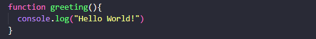
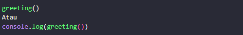
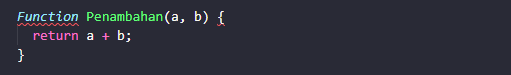
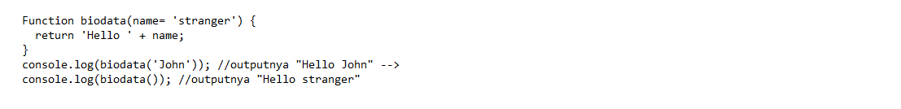
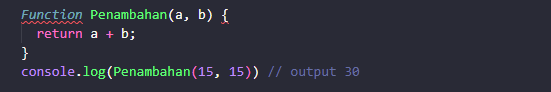
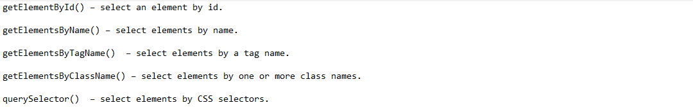
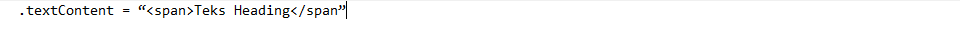

# Writing Week 2

- <b> JavaScript Scope</b>  
   - Scope Scope adalah konsep dalam flow data variabel. Terdapat dua jenis variabel scope yang ada di JavaScript yaitu Global Variable dan Local Variable.

   - Local Scope adalah Variabel lokal hanya dapat diakses dari dalam fungsi tersebut.
   - Global Scope Semua variabel yang dibuat di luar fungsi disebut variabel global JavaScript.

- <b>JavaScript Function</b> 

Sebuah Code Yang disatukan menjadi satu kelompok yang berfungsi untuk menyelesaikan suatu task 

Contoh 

 

Memanggil Function 

 

- <b>Parameter dan Argumen</b> 

  - <b>Parameter Function</b> 

    Contoh 

     

    <b>Default Parameter</b> 
     Default paramaters  digunakan untuk memberikan nilai awal/default pada parameter function. Default parameters bisa digunakan jika kita ingin menjaga function agar tidak error saat dipanggil tanpa argumen.  
     

  - <b>Argument Function</b> 
    
    Contoh 

     

- <b>Tipe Data dalam JavaScript</b> 

  - <b>Primitive</b>
    - Numbers
    - String
    - Booleans
    - Undefined
    - Null
  - <b>Non-Primitive</b>
    - Objects
    - Arrays
    - Functions

- <b>HTML DOM</b> 
DOM adalah cara untuk memanipulasi element. 

  <b>Section Selecting elements</b>
   

- <b>Memanipulasi element HTML</b> 
 Caranya Mencari Element HTML Mengubah Konten Element (Element.textContent dapat kita gunakan untuk mengubah teks di dalam sebuah element 
 
  - <b>Element.textContent</b> 

   

  - <b>Element.innerHTML</b> 
   

